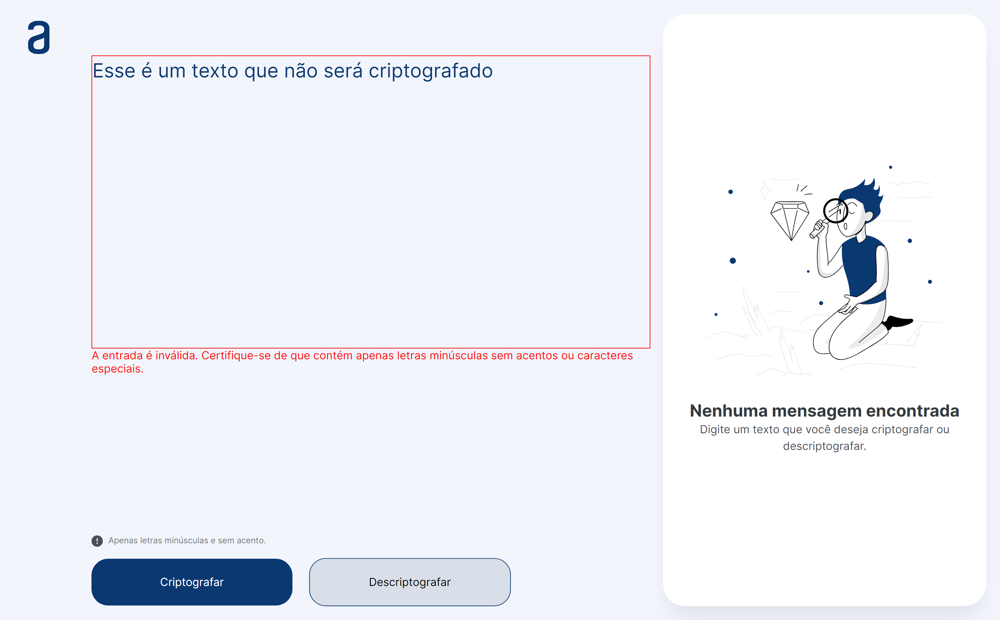

## Decodificador de Texto

### Overview
Este é um simples projeto de aplicação web que permite a criação e decodificação de mensagens secretas usando um método de criptografia personalizado. As chaves de criptografia utilizadas são:

A letra "e" é convertida para "enter"
A letra "i" é convertida para "imes"
A letra "a" é convertida para "ai"
A letra "o" é convertida para "ober"
A letra "u" é convertida para "ufat"

## Funcionalidades

### Criptografar Mensagem
- Insira o texto desejado no campo de entrada.
- Selecione a opção "Criptografar".
- O resultado da criptografia será exibido na tela.

Exemplo:
```
Texto: "gato"
Resultado: "gaitober"
```
### Descriptografar Mensagem
- Insira a mensagem criptografada no campo de entrada.
- Selecione a opção "Descriptografar".
- O resultado da descriptografia será exibido na tela.

Exemplo:
```
Texto Criptografado: "gaitober"
Resultado: "gato"
```
### Copiar Resultado
- Após a criptografia ou descriptografia, você pode clicar no botão "Copiar" para copiar o texto resultante para a área de transferência.

## Requisitos
- A aplicação suporta apenas letras minúsculas, sem acentos ou caracteres especiais.
- As opções de criptografia e descriptografia são sensíveis a maiúsculas e minúsculas.

## Deploy
[Deploy](https://luisbarrichello.github.io/Decodificador-de-Texto/)

## Tecnologias
As principais tecnologias utilizadas nesta aplicação são:
- HTML
- CSS
- JavaScript

## Screenshots





## Autor

- Luís Gabriel V. Barrichello
- [ Linkedin - Luís Gabriel Barrichello ](https://www.linkedin.com/in/luisgabrielbarrichello/)
